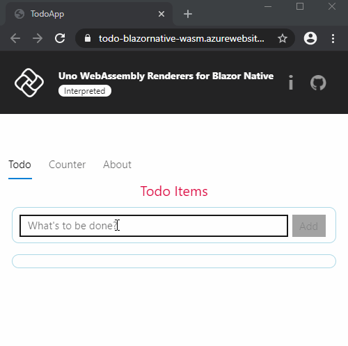

# Todo App using Uno WebAssembly Renderers for Blazor Native

This is the home of the [Uno Platform](https://github.com/unoplatform/uno) Todo App sample for Blazor Native running on WebAssembly, based on the [original Todo App](https://github.com/xamarin/MobileBlazorBindings/tree/master/samples/MobileBlazorBindingsTodoSample) from the Blazor team.

**Try it live at: https://todo-blazornative-wasm.platform.uno**

This technology preview demonstrates the use of [Uno Xamarin.Forms Renderers for WebAssembly](), the underlying technology for [Blazor Native](https://github.com/xamarin/MobileBlazorBindings).

This application is mostly developed using Razor pages for [Blazor](https://dotnet.microsoft.com/apps/aspnet/web-apps/blazor), and most of the code is in the [`ToDoApp`](src/TodoApp) project. The rendering of pages is done through Blazor Native, which relies on Xamarin.Forms for the markup and uses the Uno Platform Renderers to show the final UI.

## Experimenting with the solution

Here's how to build the app in Visual Studio for Windows:
- Open [src/TodoApp.sln](src/TodoApp.sln)
- Expand the **TodoApp** project
- Take a look at the [`TodoAppMainPage.razor`](src/TodoApp/TodoAppMainPage.razor) file.
- To run the app, set the `TodoApp.Wasm` project as Startup Project
- Run the app in **IIS Express** without the debugger

